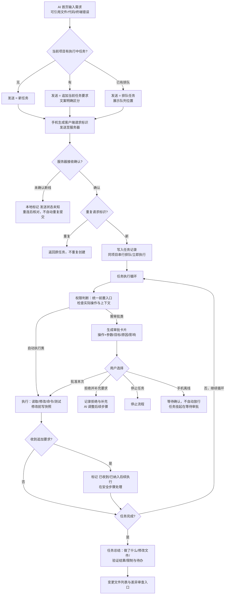
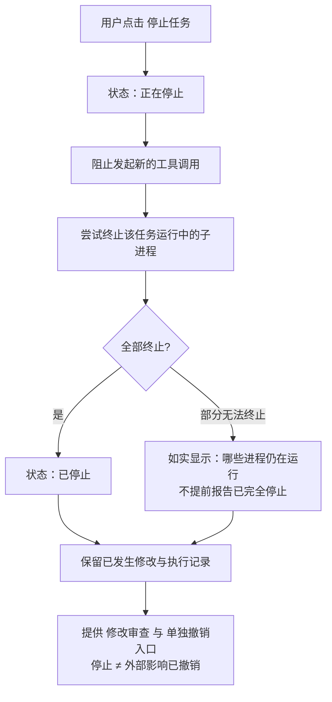
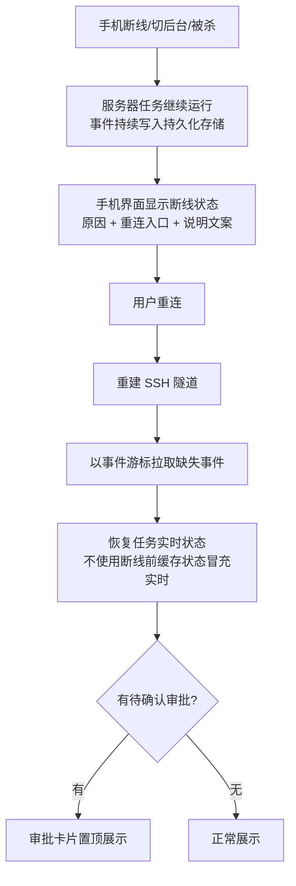
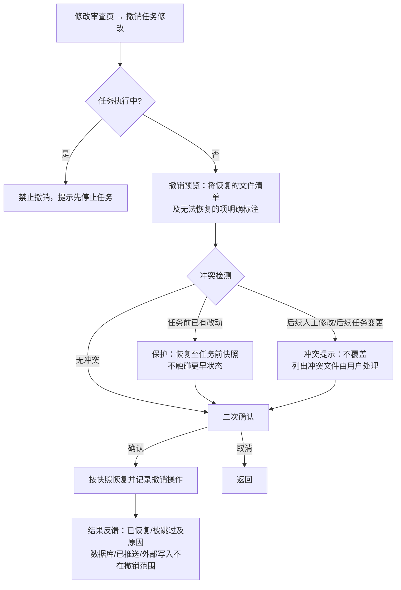

# 流程：AI 任务、审批与撤销

**版本：V0.1 · 2026-09-18**
**对应任务：P0-03 支撑流程**
**覆盖需求：REQ-AI-07—22、REQ-PERM-01—09、REQ-UNDO-01—08、REQ-OPS-01—03、REQ-PROJ-10、11、REQ-UI-15**
**配套原型：prototypes/ai-home.html、task-states.html、approval.html、review.html、states.html**

## 1. 任务生命周期主流程

## 2. 停止流程

## 3. 断线与恢复流程

## 4. 撤销流程

## 5. 关键设计要点

1. **去重三原则**：客户端请求标识去重（任务提交）、审批与具体操作绑定（操作变更需重新申请）、断线指令"发送状态未知"不自动重发（REQ-OPS-01、REQ-PERM-09、REQ-UI-15，对应 AC-17）。
2. **权限判断前置统一入口**：任何工具执行前过权限规则，凭实际操作与上下文判断，不凭命令名放行，也不单凭模型自我声明（REQ-PERM-02）。
3. **串行与并发**：同项目按规范化目录串行排队，跨项目并发；资源不足如实报告（REQ-PROJ-10—12）。
4. **快照先于修改**：修改类工具执行前必写快照；快照写失败（如磁盘不足）时暂停写入并明示"不可撤销"风险，不虚假承诺（REQ-UNDO-04、REQ-OPS-11）。
5. **手机离线安全语义**：任务继续、审批等待、不自动放行（REQ-PERM-08，对应 AC-8、AC-9）。
