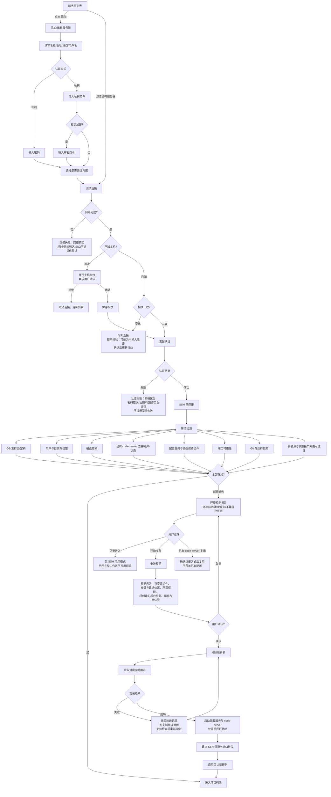
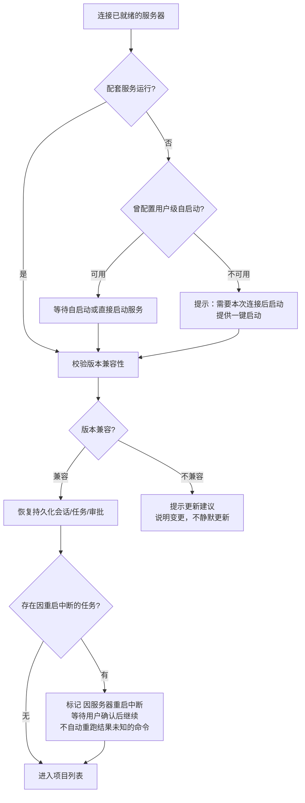

# 流程：服务器连接与环境准备

**版本：V0.1 · 2026-09-18**
**对应任务：P0-02**
**覆盖需求：REQ-CONN-01—11、REQ-ENV-01—11、REQ-SEC-06、REQ-UI-05、REQ-UI-15**
**配套原型：prototypes/server-list.html、server-add.html、env-setup.html、states.html**

## 1. 主流程

## 2. 服务器重启与服务恢复子流程

## 3. 关键设计要点

1. **状态分离**：SSH 可连接 ≠ 工作区可运行，两个状态在 UI 上分开表达（REQ-ENV-02）。
2. **失败文案**：每一步失败给出具体原因与下一步操作，禁止笼统"连接失败"（REQ-ENV-03、REQ-UI-05）。
3. **凭据路径**：选择"记住凭据"→ Android Keystore 加密存储，可开启生物识别/锁屏验证；不记住 → 仅本次会话内存持有（REQ-CONN-07、REQ-SEC-01、02）。
4. **网络边界**：配套服务与 code-server 仅监听 127.0.0.1，手机经 SSH 本地端口转发访问，不新增公网端口（REQ-SEC-06，对应 AC-3）。
5. **提权边界**：安装全程使用登录用户权限；需要 root 的步骤列出命令由用户自行执行，App 不自动提权（REQ-ENV-06、REQ-SEC-07）。
6. **幂等重试**：安装按阶段记录检查点，中断后重试跳过已完成阶段，不覆盖已有实例配置（REQ-ENV-05、07）。

## 4. 本流程覆盖的异常场景（需求第 13 节）

| 场景 | 流程节点 | 行为 |
|---|---|---|
| SSH 密码/私钥错误 | J | 区分认证失败与网络失败 |
| 主机指纹变化 | H | 阻断静默连接，要求核验 |
| 环境不兼容 | O | SSH 可用，说明工作区不可用原因 |
| 安装中断 | T | 保留阶段记录，可检查后重试 |
| 服务器重启 | 子流程 | 恢复记录，中断任务等待确认 |
