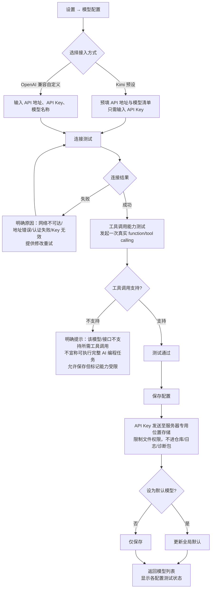
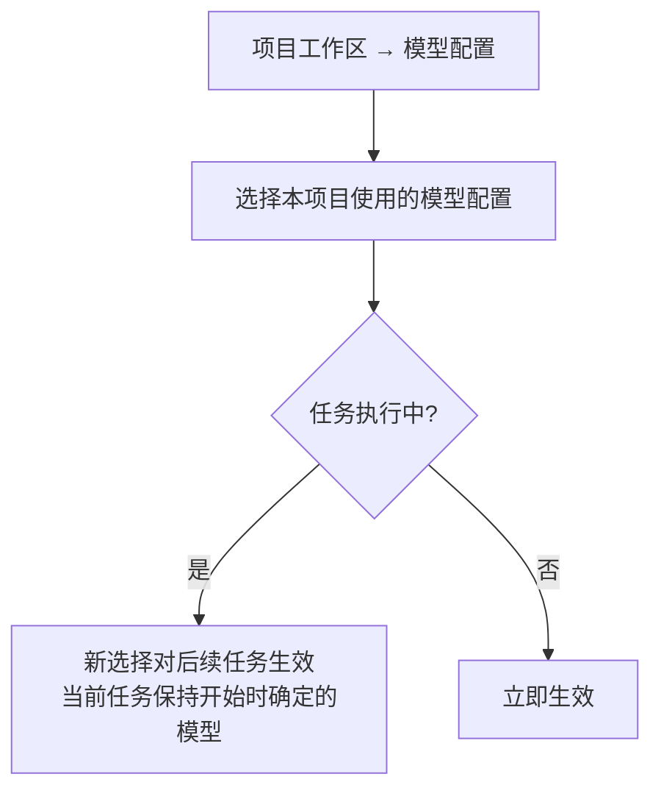

# 流程：模型配置

**版本：V0.1 · 2026-09-18**
**对应任务：P0-02**
**覆盖需求：REQ-AI-01—06、REQ-SEC-03、05**
**配套原型：prototypes/settings.html（模型配置区）**

## 1. 主流程

## 2. 项目级模型选择

## 3. 关键设计要点

1. **能力测试先于可用声明**：必须通过真实工具调用测试才标记"可用于 AI 编程"（REQ-AI-06，对应 AC-5）。
2. **Key 的流向**：手机输入 → SSH 隧道 → 服务器专用存储（权限 600）；手机本地不留存模型 Key；支持更新与删除（REQ-SEC-03、05）。
3. **协议差异记录**：P1 需实测 Kimi 与另一兼容服务的流式输出、工具调用格式、错误结构差异并记录（REQ-AI-06），适配范围以实测为准。
4. **执行中修改配置**：仅影响后续任务，避免运行中任务行为漂移（REQ-AI-05）。
5. **失败处理**：认证失败/额度不足在任务执行中触发时，任务转"受阻"并指向模型配置修正入口（REQ-AI-22）。
